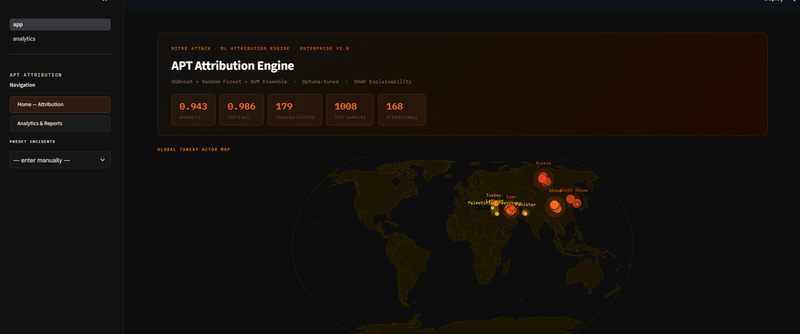
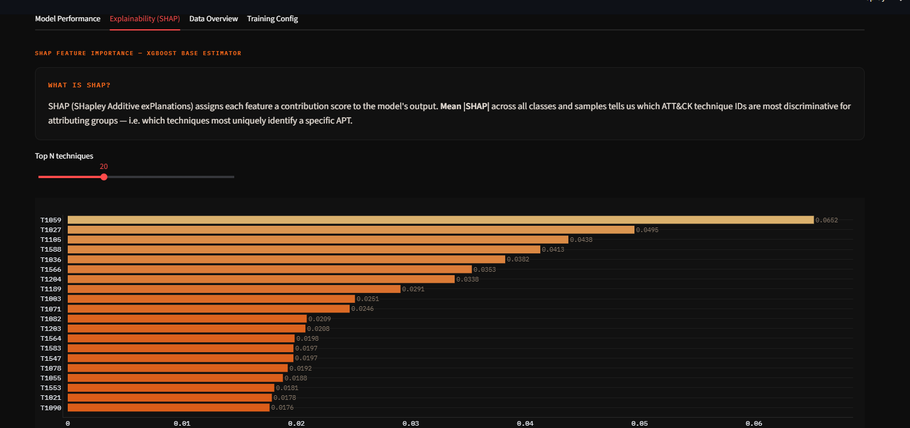

 


# APT Group Attribution Engine

**Live Site → [apt-attribution-engine-3ercpguq6nmlectyqrzrj5.streamlit.app](https://apt-attribution-engine-3ercpguq6nmlectyqrzrj5.streamlit.app/)**

## Tech stack

`scikit-learn` · `XGBoost` · `imbalanced-learn (SMOTE)` · `Optuna` · `SHAP` · `Streamlit` · `Plotly` · `pandas` / `NumPy` · `pytest`

A machine-learning pipeline that attributes a cyber incident to the most likely **APT (Advanced Persistent Threat) group**, using only the [MITRE ATT&CK®](https://attack.mitre.org/) technique IDs observed during the incident.

Given a list of technique IDs (e.g. `T1059`, `T1003`, `T1566`), the system returns the **top-3 most probable threat groups** with calibrated confidence scores — in under 200 ms — and exposes the whole thing through a Streamlit dashboard.

<!-- ```python
from inference import predict_top3

predict_top3(["T1059", "T1003", "T1566"])
# [{"rank": 1, "group": "APT28", "confidence": 0.847}, ...]
``` -->

Built as part of Industrial Training at **Central Coalfields Limited (CCL)**, Darbhanga House, Ranchi.

---

<div align="center">

## Home Page


## Model Performance


## Data Overview


## Feature


</div>

## Table of Contents

- [Why this exists](#why-this-exists)
- [Results](#results)
- [Architecture](#architecture)
- [Repository structure](#repository-structure)
- [Setup](#setup)
- [Usage](#usage)
- [Methodology](#methodology)
- [Testing & validation](#testing--validation)
- [Known limitations](#known-limitations)
- [Roadmap](#roadmap)
- [Tech stack](#tech-stack)
- [References](#references)

---

## Why this exists

APT groups rotate infrastructure constantly, but rarely change their underlying **Tactics, Techniques and Procedures (TTPs)**. During an active incident, defenders often have a partial list of observed techniques — from EDR alerts, SIEM rules, or a threat-intel writeup — well before a human analyst has time to manually cross-reference them against 150+ known threat actors. This project automates that first pass.

## Results

Evaluated on a genuinely held-out, stratified 20% test split (never seen during training):

| Metric | Target | Achieved |
|---|---|---|
| Macro F1-score | ≥ 0.62 | **0.943** |
| Top-3 accuracy | ≥ 0.80 | **0.986** |
| Macro Precision | — | 0.952 |
| Macro Recall | — | 0.943 |
| Inference latency (p99) | < 200 ms |  met |

Dataset: **168** APT groups × **204** ATT&CK techniques → **5,040** samples (4,032 train / 1,008 test) after augmentation.

>  See [Testing & validation](#testing--validation) — a high held-out score alone doesn't prove real-world generalisation. This repo includes an explicit audit for that.

## Architecture

```
MITRE ATT&CK STIX bundle
        │
        ▼
01_ingestion_feature_matrix.ipynb   → X.joblib, y.joblib, feature_vocab.joblib
        │
        ▼
02_training_pipeline.ipynb          → SMOTE + Optuna-tuned ensemble → model.joblib
        │
        ▼
03_evaluation.ipynb                 → metrics, confusion matrix, SHAP
        │
        ▼
04_inference_function.ipynb         → encode_incident() / predict_top3() → inference.py
        │
        ▼
app.py (Streamlit)                  → live attribution + Analytics & Reports dashboard
```

**Model:** a soft-voting ensemble of **XGBoost** (gradient-boosted trees), **Random Forest** (bagged trees), and a **calibrated linear SVM** (Platt/isotonic scaling), tuned with **Optuna** (TPE sampler, 60 trials, Stratified K-fold CV, macro-F1 objective).

## Repository structure

```
.
├── 01_ingestion_feature_matrix.ipynb   # STIX parsing, feature matrix, augmentation
├── 02_training_pipeline.ipynb          # SMOTE, Optuna search, ensemble training
├── 03_evaluation.ipynb                 # held-out metrics, confusion matrix, SHAP
├── 04_inference_function.ipynb         # encode_incident/predict_top3, exports inference.py
├── inference.py                        # standalone inference module (no API/Docker needed)
├── app.py                              # Streamlit dashboard — Home / Attribution
├── pages/
│   └── analytics.py                    # Streamlit dashboard — Analytics & Reports
├── test_inference.py                   # pytest suite for the inference contract
├── check_leakage.py                    # train/test leakage audit (see below)
├── artifacts/                          # X.joblib, y.joblib, feature_vocab.joblib,
│                                        #   eval_summary.json, shap_importance.json,
│                                        #   confusion_matrix.png, shap_importance.png
└── models/
    ├── model.joblib                    # trained ensemble
    └── training_metadata.json          # hyperparameters, split config, sanity metrics
```

## Setup

```bash
git clone <this-repo>
cd apt-attribution-engine
python -m venv venv && source venv/bin/activate      # optional but recommended
pip install -r requirements.txt
```

<details>
<summary><code>requirements.txt</code> (core dependencies)</summary>

```
numpy
scipy
scikit-learn
xgboost
imbalanced-learn
optuna
shap
joblib
matplotlib
seaborn
streamlit
plotly
pytest
```
</details>

Place the [MITRE ATT&CK Enterprise STIX bundle](https://github.com/mitre-attack/attack-stix-data) JSON files under `data/` before running notebook 1.

## Usage

**1. Run the pipeline end to end** (in order):

```bash
jupyter notebook 01_ingestion_feature_matrix.ipynb   # → artifacts/*.joblib
jupyter notebook 02_training_pipeline.ipynb          # → models/model.joblib
jupyter notebook 03_evaluation.ipynb                 # → eval metrics + SHAP
jupyter notebook 04_inference_function.ipynb         # → inference.py
```

**2. Launch the dashboard:**

```bash
streamlit run app.py
```

**3. Or call inference directly in Python:**

```python
from inference import predict_top3

results = predict_top3(["T1566", "T1059", "T1027", "T1003", "T1021", "T1053", "T1105", "T1071"])
for r in results:
    print(f"#{r['rank']}  {r['group']:<20} {r['confidence']:.4f}")
```

Sub-technique IDs (e.g. `T1059.001`) are automatically collapsed to their root (`T1059`); unrecognised IDs are skipped with a warning rather than raising an error, unless *all* IDs are unrecognised.

## Methodology

- **Feature engineering**: groups and techniques parsed from STIX `intrusion-set` / `attack-pattern` / `uses`-relationship objects; deprecated/revoked objects dropped; sub-techniques root-collapsed.
- **Signature-preserving augmentation**: each group is anchored with several exact copies of its full technique vector, plus synthetic rows generated via **high-retention dropout** (75–100% of techniques kept) — this replaced an earlier random ⅓-sample strategy that destroyed discriminative signal.
- **Class imbalance**: handled with **SMOTE** (`k=2`), fit only on the training split, *after* the stratified 80/20 split — the test set never contains synthetic points.
- **Hyperparameter search**: Optuna's TPE sampler over XGBoost/Random Forest hyperparameters and ensemble voting weights.
- **Explainability**: SHAP `TreeExplainer` on the XGBoost base estimator, ranking techniques by mean `|SHAP|` across all classes and test samples.

<!-- ## Testing & validation

A high macro-F1 on a held-out split is a necessary but not sufficient condition for trusting this system on real, unseen incidents. Three independent checks are included:

| Check | File | What it verifies |
|---|---|---|
| **Automated test suite** | `test_inference.py` | Inference contract shape, edge cases (empty/unknown IDs), sub-technique collapsing, input-order invariance, known-signature recovery, confidence sanity on minimal input, p99 latency |
| **Train/test leakage audit** | `check_leakage.py` | Whether the augmentation strategy's full-signature anchors let identical rows land on both sides of the train/test split — which would silently inflate the reported metrics |
| **Narrative-based validation** | *(manual, see report)* | Realistic, free-text incident descriptions mapped to technique IDs and run through `predict_top3()`, including minimal and deliberately conflicting ("false-flag") cases |

Run the automated checks:

```bash
pytest test_inference.py -v
python check_leakage.py
```

`check_leakage.py`'s output should be archived alongside `training_metadata.json` / `eval_summary.json` for every model version — it's treated as a required part of the evaluation, not an optional extra. -->

## Known limitations

- Groups with fewer than 3 documented techniques are excluded from training entirely.
- **False-flag contamination**: real attackers reuse other groups' tools; the model can be misled by deliberate cross-contamination of TTPs.
- The dataset reflects what's *publicly documented* at a point in time — novel or low-profile groups are underrepresented.
<!-- - Input is technique IDs, not free text — a production analyst workflow needs a separate NLP extraction layer (not yet built; see Roadmap).

## Roadmap

- [ ] Make the leakage audit a permanent, versioned step in every retraining cycle
- [ ] Build an NLP layer mapping free-text incident reports directly to technique IDs
- [ ] Full confidence-calibration / reliability-diagram analysis beyond top-3 accuracy
- [ ] Group-level (not row-level) train/test splitting to rule out leakage structurally
- [ ] CI pipeline running `test_inference.py` as a regression gate before promoting a new model
 -->

## References

1. MITRE Corporation, [MITRE ATT&CK® Enterprise Matrix](https://attack.mitre.org)
2. Chawla et al., *SMOTE: Synthetic Minority Over-sampling Technique*, JAIR 2002
3. Chen & Guestrin, *XGBoost: A Scalable Tree Boosting System*, KDD 2016
4. Breiman, *Random Forests*, Machine Learning 2001
5. Lundberg & Lee, *A Unified Approach to Interpreting Model Predictions*, NeurIPS 2017
6. Akiba et al., *Optuna: A Next-generation Hyperparameter Optimization Framework*, KDD 2019

---

*Developed by Sana Perween (BTECH/10838/23), Dept. of EEE, BIT Mesra — Industrial Training at Central Coalfields Limited, under the guidance of Sri Digvijay Singh, DY. Manager (E&T).*
>>>>>>> 5efbd74d86646b20ccb7136e387739b784c96b73
